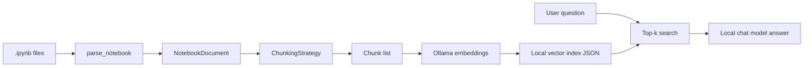

# nbrag

`nbrag` is a small, laptop-friendly demo of retrieval-augmented generation (RAG) over
Jupyter notebooks using **small local models** through [Ollama](https://ollama.com). It
parses notebooks without executing them, turns them into notebook-aware retrieval chunks,
embeds those chunks into a local JSON vector index, and answers questions about the
notebooks from retrieved context.

Two commands are the whole demo:

- **`nbrag-embed`** — build a vector index from a folder of notebooks.
- **`nbrag-chat`** — ask questions against that index.

> **Scope.** This is a working demo, not a product. Deeper benchmarking of chunking and
> retrieval strategies, and evaluation against a corpus of real-world notebooks, were
> explored and then set aside — see [Deferred](#deferred). What remains is the part that
> reliably works: index a small set of synthetic notebooks and ask questions about them
> with tiny local models.

## How It Works

Processing is file-based and in-process: there is no database or background worker.



1. **Parse** — `nbformat` reads each `.ipynb` into a `NotebookDocument`: cell type, source,
   metadata, execution count, and stored outputs (text, errors, figure mime types). Cells
   are never re-run.
2. **Chunk** — A `ChunkingStrategy` emits `Chunk` records with text, notebook id, and cell
   indices.
3. **Embed** — Chunks are embedded in batches through Ollama's native **`/api/embed`**
   endpoint, L2-normalized, and written to a JSON index alongside chunk text and metadata.
4. **Answer** — At question time the query is embedded with the same model; the **top-k
   chunks** are chosen by dot product (cosine similarity on normalized vectors), formatted
   with notebook id, cell indices, and scores, and sent to **`/api/chat`** with a system
   prompt that restricts answers to that context and asks for citations.

## Chunking Strategies

| Strategy | Name | Behavior |
|----------|------|----------|
| Naive text | `naive_text` | Concatenate all cell text, split into overlapping word windows (default 180 words, 30 overlap). |
| Per cell | `cell` | One chunk per non-empty cell (source plus serialized outputs). |
| Triad | `triad` | For each code cell, bind preceding markdown, the code, and stored outputs into one chunk; standalone markdown cells get their own chunks. |

`triad` is the default for indexing because it keeps symbols, narrative context, and
output summaries together — useful for science notebooks where the "answer" often spans
markdown plus a code cell and its result. Pass `--chunker cell` or `--chunker naive_text`
to `nbrag-embed` to index a different strategy.

## Setup

Install dependencies with [`uv`](https://docs.astral.sh/uv/):

```sh
uv sync --group dev
```

Ollama itself is not installed by this repo. Run the daemon and pull the demo models on
the host where Ollama runs:

```sh
ollama pull qwen3-embedding:0.6b
ollama pull granite4.1:3b
```

These two models are the confirmed-working defaults (set in `src/nbrag/ollama.py`):

| Model | Role | Notes |
|-------|------|--------|
| **`qwen3-embedding:0.6b`** | Embeddings | 1024-dimensional vectors; used for indexing and query embedding. |
| **`granite4.1:3b`** | Chat / answers | Small instruct model; answers from retrieved notebook context only. |

Override with `OLLAMA_EMBED_MODEL`, `OLLAMA_CHAT_MODEL`, and `OLLAMA_HOST` (default
`http://127.0.0.1:11434`).

**Dev container → host Mac:** Ollama often listens only on the host. From a container, use:

```sh
export OLLAMA_HOST=http://host.docker.internal:11434
# OrbStack: http://host.orb.internal:11434
```

## Run the Demo

### 1. Build an index

Point `nbrag-embed` at a notebook directory (searched recursively) or a single `.ipynb`:

```sh
uv run nbrag-embed examples/notebooks --output indexes/notebooks.json
```

A single notebook (fast smoke test):

```sh
uv run nbrag-embed examples/notebooks/synthetic_forecast/synthetic_forecast.ipynb \
  --output indexes/forecast.json
```

`nbrag-embed` defaults to the `triad` chunker and `qwen3-embedding:0.6b`. Progress and
errors go to stderr; the index JSON is written to `--output` (default `indexes/notebooks.json`).
The `indexes/` folder is gitignored — regenerate it any time.

### 2. Chat against an index

One-shot question:

```sh
uv run nbrag-chat indexes/notebooks.json \
  --question "What is the primary resistance hit in the NBX-042 CRISPR screen?"
```

Interactive session (type `exit` or `quit` to leave):

```sh
uv run nbrag-chat indexes/notebooks.json
```

Use `--show-context` to print the retrieved chunk text under each source. The chat CLI
uses the embedding model recorded in the index unless you pass `--embed-model`.

Example outcomes from manual smoke tests: correct identification of `forecast_demand` in
the forecast notebook, and **`KEAP1`** as the primary resistance hit in
`synthetic_crispr_resistance_screen`.

## Development Checks

```sh
uv lock --check
uv run ruff check .
uv run ruff format --check .
uv run pyright
uv run pytest
uv run bandit -c pyproject.toml -r src
uv run pip-audit --cache-dir .cache/pip-audit
```

## Deferred

Out of scope for this demo: a full benchmarking harness (recall@k / MRR / nDCG scoring of
chunking and retrieval strategies, end-to-end answer grading), a curated corpus of real
notebooks, and any product layer — API server, MCP tools, web UI, persistent
Postgres/pgvector storage, auth, rendered notebook viewing, and durable permalinks.

## Repository Layout

| Path | Purpose |
|------|---------|
| `src/nbrag/` | Parser, chunking, Ollama clients, local vector index, and the `nbrag-embed` / `nbrag-chat` CLIs |
| `examples/notebooks/` | Flat synthetic corpus; artifact subfolders only when a notebook reads sibling files |
| `tests/` | Parser, chunker, Ollama usage, and index round-trip tests |
| `docs/` | Architecture notes |
| `indexes/` | Generated vector indexes (gitignored) |

CLI entry points (via `pyproject.toml`): `nbrag-embed`, `nbrag-chat`.
