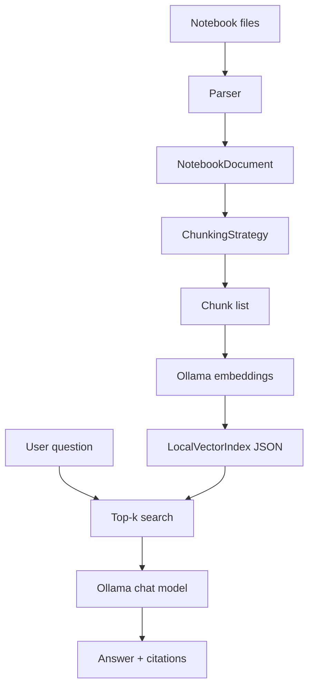

# Architecture

`nbrag` is a small, file-based demo: index a set of Jupyter notebooks and answer
questions about them with small local models served by [Ollama](https://ollama.com).
There is no database, server, or background worker — everything runs in-process and the
index is a plain JSON file on disk.

The pipeline:

1. Parse notebooks with `nbformat` (cells are never executed).
2. Normalize cells and stored outputs into typed models (`src/nbrag/models.py`).
3. Produce chunks with a swappable chunking strategy (`src/nbrag/chunking.py`).
4. Embed chunks through Ollama and store them in a local vector index
   (`src/nbrag/rag.py`).
5. At question time, embed the query, retrieve top-k chunks by cosine similarity, and
   ask a local chat model to answer from that context with citations.

## Chunking strategies

Three strategies are available; `triad` is the default for indexing. See the README's
"Chunking Strategies" table for behavior and rationale — triad keeps a code cell together
with its preceding markdown and its stored outputs, which is where notebook answers
usually live.

## Boundaries

- The parser never executes notebooks; it reads source and *stored* outputs only.
- Chunkers operate on parsed notebook structure, not raw JSON.
- Retrieval and answering are in-process, so the demo stays cheap and reproducible on a
  laptop.

## Deferred

Persistent indexing (Postgres/pgvector), an API or MCP layer, a web UI, durable notebook
IDs, and a broader real-notebook corpus are out of scope for this demo.
